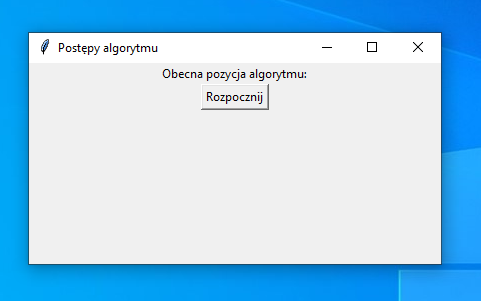
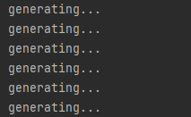
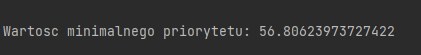
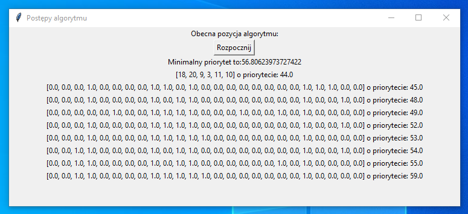
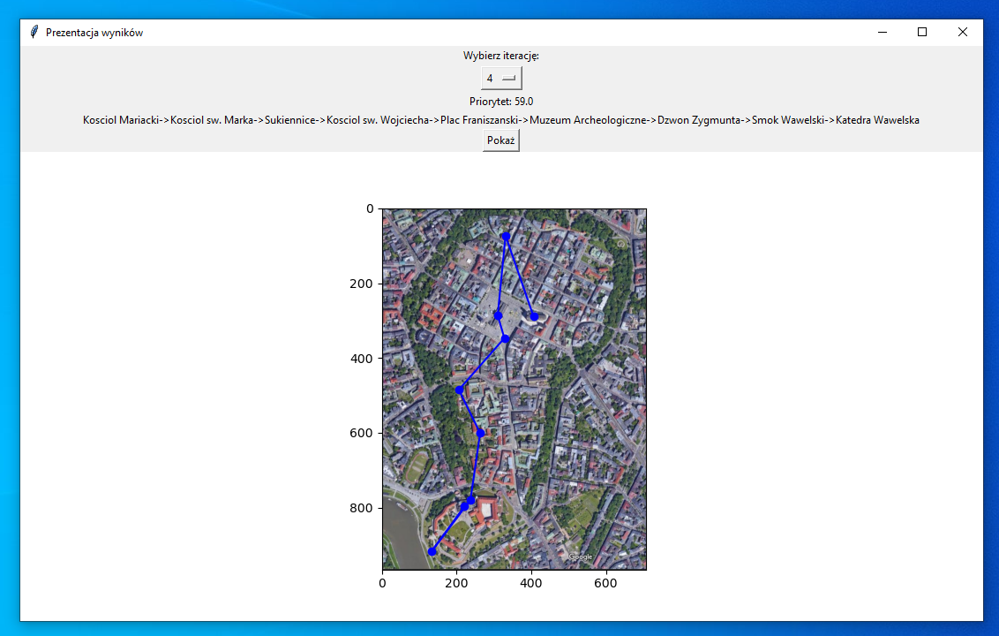

# Trip around Krakow

### The project uses genetic algorithm to find the best road of a trip around Krakow.

## Technical description
_________________

Project has been created during studies for "Mathematical Methods of Decision Support".
It does not contain the best programming practices and requires some improvements.

The project has been written mainly with Python langauge. 
It uses some python libraries like:
- numpy,
- matplotlip,
- csv,
- typing,
- datetime,
- copy,
- tkinter,
- random.

It includes a complete implementation of the genetic algorithm "Particle Swarm Optimization (PSO)" 
(implementation has been invented by us).

## User guide
_________________

**Functionality description**

Imagine a situation that you are organizing trips around Krakow.
A customer comes to you and tells you the start time, end time and maximum cost of a trip.
You have to show him\her the best tour taking into account the opening hours of monuments and the cost of sightseeing.
You should also take into account the time needed to travel between monuments.
Does visiting churches mean more than a castle?
You should think about a lot of requirements in the same time!

Too hard? This app can do it for you!

**Parameters configuration**

In file located in files/config.csv, there is a csv file includes parameters values. 
The file includes 26 parameters and their values.

 You can manage whole app by changing them.
 For example you can turn off the GUI mode or the logs creation.

There are also parameters defining the customer requirements and genetic algorithm paramteres like number of particles or start tour time.
And a lot more...

##!!! Warning !!!
___________
If the application does not end, the minimum calculated priority is probably too high, define your own value in the configuration file.

## How to run app
____________

**Step 0:**  
Install python and required libraries.  
Run main.py file with python interpreter.

**Step 1:**  
Find app window and click button "Rozpocznij":   

**Step 2:**  
Console calculations:  
Generation of particles starts:  

Minimal priority is being calculated (if it has not been defined as a const):  

The algorithm starts finding possible roads which meet minimal priority requirement and other limitations.
It can take some time.   

**Step 3:**  
The result is being showed in the app window.  

**Step 4:**  
New window is being opened.  

By clicking button under the text "Wybierz iteracje" you can choose which sollution you want to see.
After choosing iteration it is needed to click button "Pokaz".
The last iteration includes the best solution (the one with max priority).
  
On the map road of the selected is being showed.

